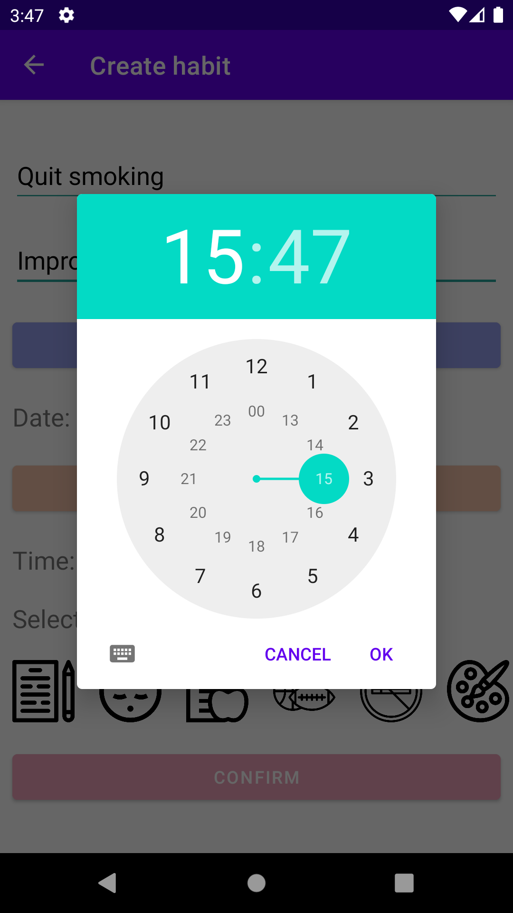

# improving-habits

Having a routine can greatly improve your health.

Your daily routine influences your quality of rest. 
Your sleep schedule and bedtime habits affect your mental sharpness, performance, emotional well-being and energy 
level.

So thinking about it, we created this app so you can organize your day and improve your quality of life :notebook_with_decorative_cover::rainbow:.

# Screenshots

### Intro Screen

### Home Screen

### Create Screen

